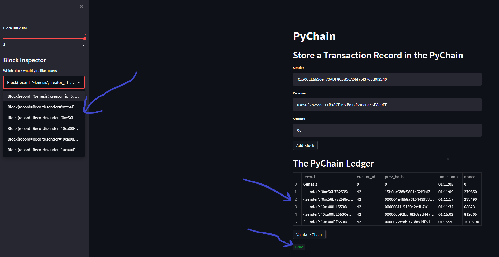

# PyChain Ledger

## Requirements
* Create a virtual 'blockchain' using Python. 
* Create a web application that will allow a user to add an entry to the ledger and see the blocks added to the 'chain'. 
* Add a button that will allow a user to 'validate' the blockchain, and report that status to the screen.
* Take Screenshot of Application that shows all of the requirements mentioned above.  

## Files

[Module 18 Homework files](Starter_Code/pychain.py)

---

---
